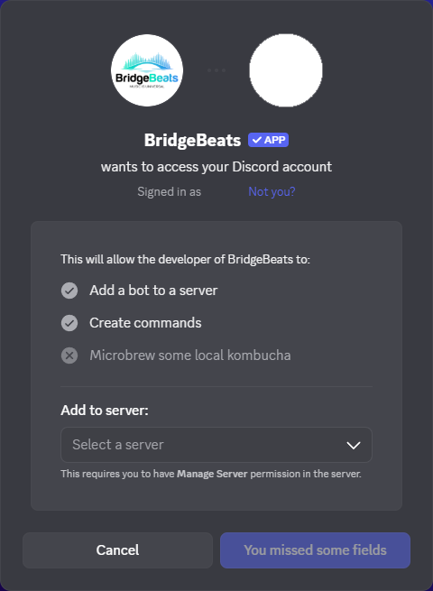
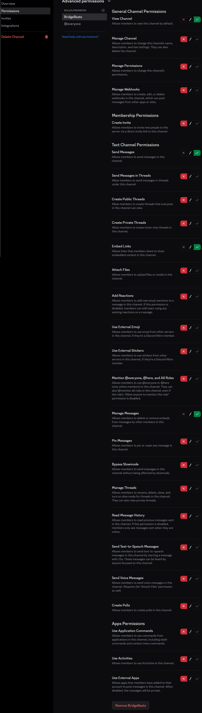
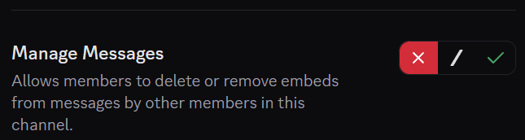
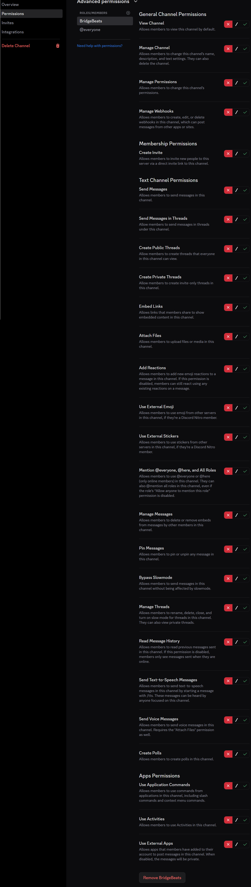

# Discord Bot Server Settings

Use Discord's channel permissions to choose where BridgeBeats can respond and whether it removes
link-only messages after posting converted music links.

## Add BridgeBeats to a server

You must have Discord's **Manage Server** permission to add the bot.

1. Open the [BridgeBeats Discord invite](https://discord.com/oauth2/authorize?client_id=1417324891161759815).
2. Under **Add to server**, select the server where you want to use BridgeBeats.
3. Select **Continue**, review the authorization request, and select **Authorize**.

The authorization screen adds the BridgeBeats bot and its commands to the server. Channel access is
controlled separately through the **BridgeBeats** role.

> [!WARNING]
> BridgeBeats has access to **all public channels by default** after it is added to a server. It can
> see messages in those channels and will respond when it detects supported music links. Restrict
> the BridgeBeats role in every public channel where you do not want the bot to operate.

## Set the required channel permissions

For each channel where BridgeBeats should operate normally:

1. Open the channel's settings.
2. Select **Permissions**.
3. Under **Advanced permissions**, add or select the **BridgeBeats** role.
4. Allow the following permissions by selecting the green check mark:

| Permission | What it allows BridgeBeats to do |
| --- | --- |
| **View Channel** | Detect supported music links posted in the channel. |
| **Send Messages** | Post the converted music links back to the channel. |
| **Embed Links** | Display the converted music links as rich embeds. |
| **Manage Messages** | Delete the original message when it contains only supported music links. |

All other channel permissions can be denied. BridgeBeats does not need them for its normal
link-conversion behavior.

> [!NOTE]
> Category and server role permissions can affect the permissions that BridgeBeats ultimately has
> in a channel. If the bot does not respond as expected, check its effective channel permissions.

## Keep users' original link messages

BridgeBeats normally removes a user's message after posting the converted links when that message
contains only supported music links. Messages that include other text are kept.

To keep link-only messages too, select the red **X** for **Manage Messages** in the BridgeBeats
channel permissions. Leave **View Channel**, **Send Messages**, and **Embed Links** allowed so the
bot can continue to detect links and respond with rich embeds.

## Remove BridgeBeats from a channel

You can prevent BridgeBeats from operating in a channel without removing it from the server:

1. Open the channel's **Permissions** settings.
2. Under **Advanced permissions**, select the **BridgeBeats** role.
3. Select the red **X** for every permission.

Denying **View Channel** prevents BridgeBeats from seeing messages in that channel. Denying every
permission makes the channel restriction explicit. Because BridgeBeats can access all public
channels by default, repeat these steps for every public channel where you do not want it to
operate.

To restore BridgeBeats later, allow **View Channel**, **Send Messages**, **Embed Links**, and
**Manage Messages** again.

If you need help configuring the bot, join the
[BridgeBeats support server](https://discord.gg/T98sGP2nX8).
